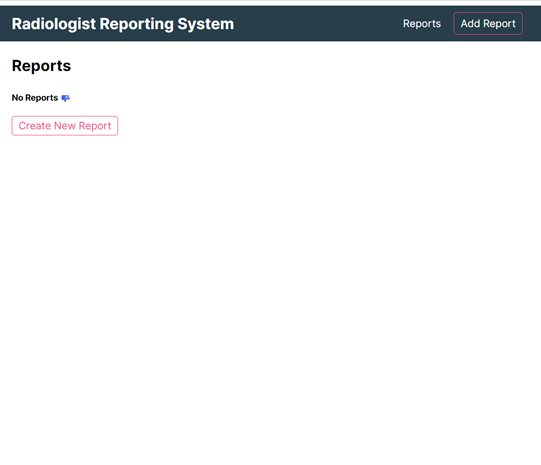

# Radiologist Reporting System

## Overview
The Radiologist Reporting System is a web application built with Django for the backend and React (and Redux) for the frontend. It allows radiologists to submit reports and manage them efficiently.

## Prerequisites
Make sure you have the following installed:

- Docker
- Python 3.x
- Node.js
- npm or Yarn

```
git clone https://github.com/Silas281/radiologist_reporting.git

cd radiologist_reporting

# Create a virtual environment

python -m venv .venv


# mac
python3 -m venv .venv

# Activate the virtual environment:
# Windows
.venv\Scripts\activate

# macOS/Linux
source .venv/bin/activate
```

## 
## Backend Setup ()
1. Install Python dependencies (Open Docker desktop before proceeding with the next setup steps):

```
cd radiologist_backend/MySQL
docker-compose up

# Wait for about a minute for the database to be fully setup

# Open a separate terminal/cmd in radiology_backend directory

#Install dependencies
pip install -r requirements.txt

#Run migrations
python manage.py migrate

#Start the Django Server
python manage.py runserver
```


## Frontend Setup
1. Navigate to the rrs_frontend directory (in a separate terminal):
```
cd rrs_frontend
```

2. Install npm dependencies:
```
npm install

# add --legacy-peer-deps flag if there is dependancy conflicts
npm install --legacy-peer-deps
```
3. Start frontend app:
```
npm run dev
```

4. Using the Application:

Use the navigation to add new reports and manage existing ones.


App Snippets

## Reports List Page


## Report Details


## No Report page


## Add new report page


## Edit Report


